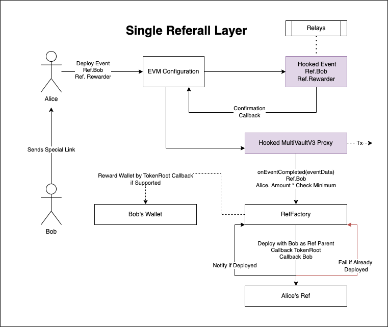
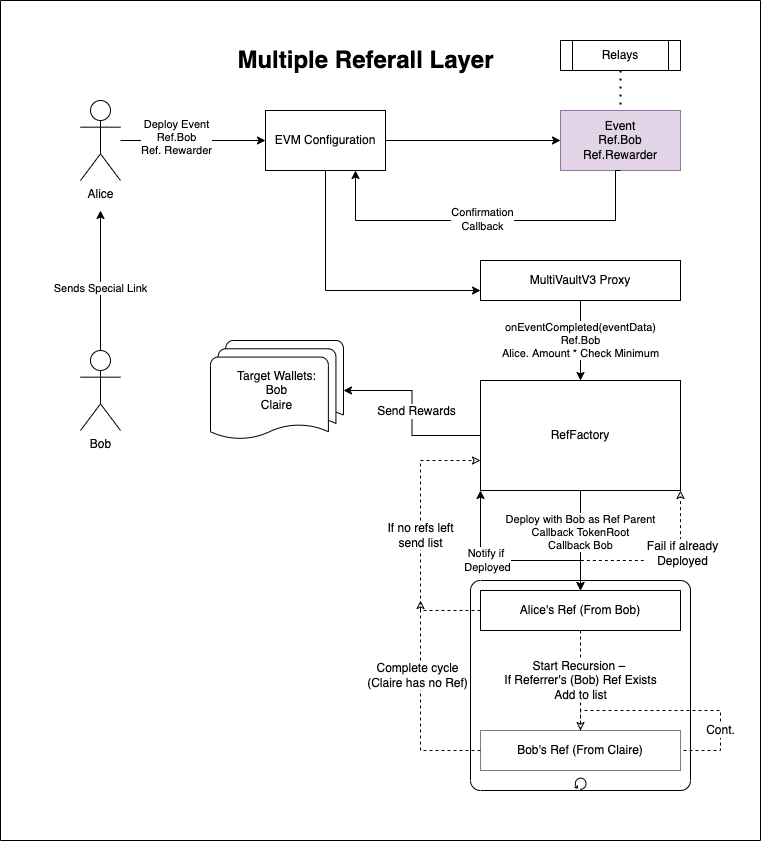

# Referall Hooks

## Single-Layer Referall
Provides a signle referall (only one person gets reward) on top of MultiToken Bridge 

##  Summary:

* Bob wishes to get a referall reward
* Bob clicks a button 'Share and Get Reward'
* Bob sends link to Alice
* Alice opens link, and decides to swap 10 WETH -> 10 Everscale ETH
* During Swap Alice includes an additional event data: the Refall Factory Address and Bob as the designated Referrer
* On Event Confirmation, the Hooked Proxy sends an `onEventCompleted()` with `eventData`
* RefFactory Recieves Callback then Deploys a Ref Contract from Alices' Address 
* If Alices' Ref already exists though It is Rejected
* If Alice's Ref is new, it does a callback with Bob as the Referrerr (Alice's Ref in this case does not require any state)
* RefFactory recieves succesfull Callback from Alice's Ref
* Based on Event Data, RefFactory sends reward to Bob's Wallet

## Multi-Layer Referall
Multi-Layer Referall (extension of Single-Layer) (multiple people can get reward)

